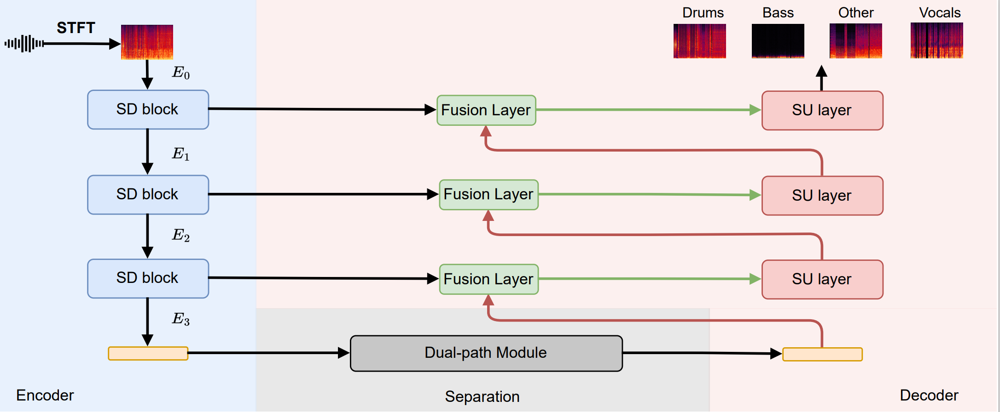

# SCNet 

This repository is the official implementation of [SCNet: Sparse Compression Network for Music Source Separation](https://arxiv.org/abs/2401.13276) 



---
# Training

The training code will be available soon. Meanwhile, you can utilize the training frameworks in these repository:

- [HTDemucs](https://github.com/facebookresearch/demucs/)
- [Music-Source-Separation-Training](https://github.com/ZFTurbo/Music-Source-Separation-Training)
- [SCNet-PyTorch](https://github.com/amanteur/SCNet-PyTorch/tree/main) - Thanks for the great implementation.

---
# Todo

- Experiments of mamba module.
- Training and evaluation code.

---
# Citing

If you find our work useful in your research, please consider citing:
```
@misc{tong2024scnet,
      title={SCNet: Sparse Compression Network for Music Source Separation}, 
      author={Weinan Tong and Jiaxu Zhu and Jun Chen and Shiyin Kang and Tao Jiang and Yang Li and Zhiyong Wu and Helen Meng},
      year={2024},
      eprint={2401.13276},
      archivePrefix={arXiv},
      primaryClass={eess.AS}
}
```
